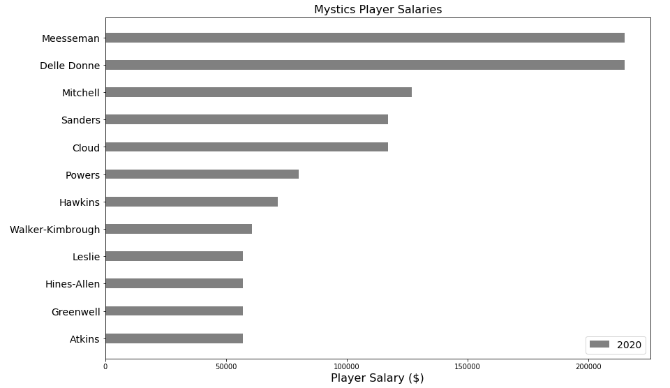

# salaries
Exploratory Analysis of NBA Salary Data

## WNBA
## Teams

The following shows the team salaries for the 2019 and 2020 WNBA seasons (as of 2/23/20)

The Wings have added a lot of salary, while the Lynx have shed quite a bit.

## Players

Here's the 2020 salaries for the Washington Mystics (as of 2/23/20)

Delle Donne and Meesseman deservedly lead the team with $215,000.

## NBA
### Teams

The following shows team salaries for the 2018-19 and 2019-20 seasons (as of 6/11/19).

The Knicks, Nets, and Clippers have some financial flexibility heading into the summer to attempt signing big free agents.

### Players

For the Philadelphia 76ers, the following shows player salaries for the 2018-19 and 2019-20 seasons (as of 6/11/19).

The 76ers can expect a bit of roster churn given the number of impending free agents. Also, Jimmy Butler and James Ennis are both expected to decline their player options.

### Historical Teams

The following shows team salaries for the 2009-10 season, along with inflation-adjusted salaries.

The Lakers led the league in payroll that year, and it paid off with an NBA Championship.

### Players

For the Lakers, the following shows player salaries for the 2009-10 season, along with inflation-adjusted salaries.

Kobe Bryant, Pau Gasol, and Andrew Bynum led the team in salary that season.
